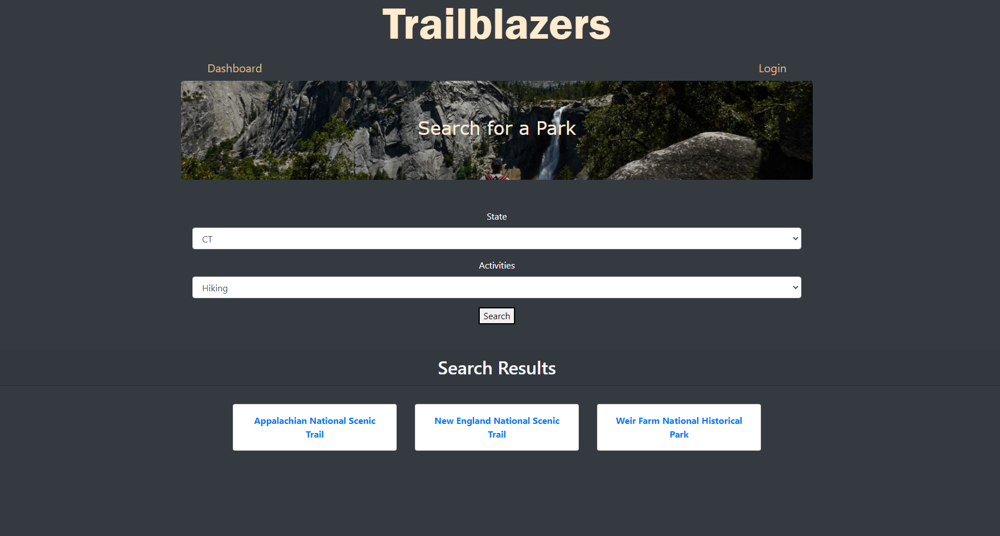

# trailblazers

[LIVE SITE](https://intense-fjord-45584.herokuapp.com/)

## TABLE OF CONTENTS

1. [Description](#description)
2. [Usage](#USAGE)
3. [Visuals](#visuals)
4. [Authors Acknowledgments](#authors-and-acknowledgments)
5. [Resources](#resources)

## DESCRIPTION
Our project is going to be a National Parks hub for park information and activities. We are using an API created by the National Park Service (NPS). This will allow our user to find parks, general information on the park, and activities within the park. Users will also be able to see and add reviews of the park. Park data includes the address, contact information, description, hours of operation and available activities.

## USAGE
Users will be able to search for specific parks without registration or login, but in order to leave reviews and save favorites they will need to register and sign in. 

## VISUALS

## AUTHORS AND ACKNOWLEDGMENTS
Mary Cancellieri
Lacy Nunnally
Hans Reichgelt 
Justin Stone
Nate Traugh

## RESOURCES

1. [LIVE SITE](https://intense-fjord-45584.herokuapp.com/)

2. [REPOSITORY](https://github.com/mycancel/trailblazers)

